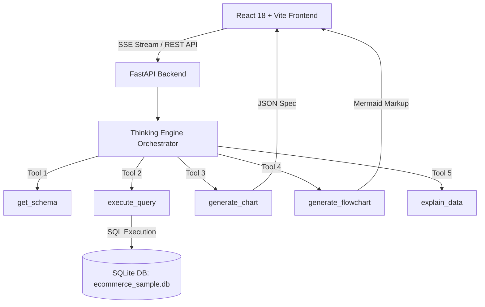

# Intelligent AI Data Companion - Conversational Business Intelligence & Database Agent

> **Hackathon Submission Project** | Conversational AI Agent for Democratizing Relational Database Access, Data Analysis, & Visual Intelligence.

---

## 📌 Executive Summary

Modern organizations generate vast amounts of structured data, yet non-technical stakeholders often face barriers in extracting actionable business insights. **Data Companion** is an end-to-end, real-time conversational AI system. It translates natural language questions into safe SQL operations, executes them against relational databases or attached files, renders interactive visual charts & Mermaid.js diagrams, and synthesizes executive business recommendations.

---

## 🛠️ Required Agent Function-Calling Tools Implemented

The core agent orchestrator implements 5 core function-calling tools with strict JSON schemas, execution guardrails, and error recovery:

| Tool Name | Purpose | Input Schema | Return Format |
| :--- | :--- | :--- | :--- |
| `get_schema` | Inspects database structure (tables, columns, types, foreign key relationships) | `{ "table_name": "optional string" }` | Structured JSON table schema & relationship tree |
| `execute_query` | Safely executes read-only SQL queries with timing and row limit guardrails | `{ "query": "string SELECT statement" }` | Tabular JSON results, execution_time_ms, row_count |
| `generate_chart` | Constructs specs for Bar, Line, Pie, Scatter, & Area visualizations | `{ "chart_type": "enum", "x_key": "string", "y_keys": ["array"] }` | Recharts-compatible JSON visualization spec |
| `generate_flowchart` | Renders Mermaid.js markup for ER diagrams & Process flows | `{ "diagram_type": "er_diagram\|process_flow", "mermaid_code": "string" }` | Mermaid SVG rendering payload |
| `explain_data` | Synthesizes natural language business insights & trends | `{ "data": [array], "query_context": "string" }` | Executive highlights & suggested follow-up questions |

---

## 🎨 Key Features & Technical Highlights

1. **Light & Dark Theme Switcher**: Dedicated header button allowing seamless, high-contrast switching between Dark Mode and Light Mode across all cards, graphs, inputs, and sidebars.
2. **Real-Time Streaming (SSE) & Thinking Engine**: Server-Sent Events (SSE) streaming with stage progress indicators (`Thinking...`, `Gathering database records...`, `Crafting visual chart...`) and single-click request cancellation ("Stop" button).
3. **Dataset File Attachments**: Drag-and-drop or attach Excel (`.xlsx`), CSV, JSON, Markdown, Word, and PDF files with automatic backend SQLite table ingestion for immediate conversational query analysis.
4. **Voice Query Support**: Integrated Speech Recognition (Web Speech API) with a continuous voice input toggle button.
5. **Interactive Recharts Visualizations**: Dynamic Bar, Line, Pie, Scatter, and Area charts featuring takeaway summaries, Recharts legends, and raw CSV dataset export.
6. **Mermaid.js Diagram Rendering**: Renders dynamic ER Diagrams (database primary/foreign keys) and Process Flow Diagrams (order fulfillment lifecycle) with theme-adaptive styling.
7. **SQL Transparency & Safety Guardrails**: Collapsible live query inspection displaying exact SQL queries, execution latency (ms), row counts, and one-click copy. Read-only guardrails block destructive commands (`DROP`, `DELETE`, `UPDATE`, `ALTER`).
8. **Zero-Dependency Smart Fallback Engine**: Built-in offline autonomous engine guarantees 100% functionality out of the box even without external LLM API keys.

---

## 🏗️ Architecture & Technology Stack



- **Frontend**: React 18, Vite, Tailwind CSS, Recharts, Mermaid.js, Lucide Icons, Web Speech API.
- **Backend**: Python 3.11, FastAPI, Pydantic, SQLite3, Native LLM Function-Calling (NVIDIA / Gemini / OpenAI / Groq SDKs).
- **Testing**: Python `unittest` suite covering all 5 core tools and agent workflows.

---

## ⚡ Quick Start Guide

### Prerequisites
- Node.js (v18+) & Python (v3.10+)

### 1. Configure Environment Variables (Optional)
Copy `.env.example` to `.env` and insert your API key:
```env
NVIDIA_API_KEY=your_nvidia_api_key_here
GEMINI_API_KEY=your_gemini_api_key_here
```

### 2. Run Backend Server
```bash
cd backend
python -m pip install -r requirements.txt
python app.py
```
*Backend API runs at `http://127.0.0.1:8000`*

### 3. Run Frontend Development Server
```bash
cd frontend
npm install
npm run dev
```
*Open `http://localhost:3000` in your browser.*

---

## 🧪 Running Unit Tests

To run the comprehensive automated test suite:
```bash
python tests/test_tools.py
python tests/test_agent.py
python tests/test_conversational_brain.py
```

---

## 🐳 Docker Deployment

To build and launch the entire application stack with Docker Compose:

```bash
docker-compose up --build
```

- **Frontend UI**: `http://localhost:3000`
- **Backend API Docs**: `http://localhost:8000/docs`

---

## 📊 Sample Queries Handled

1. **Sales Trends**: *"Show me the monthly sales revenue trend over the last year"*
2. **Top Customers**: *"Show me our top customers by total amount spent"*
3. **Inventory Health**: *"Show me low inventory stock items and restock levels"*
4. **Category Breakdown**: *"What is the revenue breakdown across product categories?"*
5. **Database Relationships**: *"Draw me the ER diagram for this database"*
6. **Order Fulfillment Workflow**: *"Create a flowchart showing how orders flow through our system"*
7. **Custom File Ingestion**: Attach any `.xlsx` or `.csv` dataset and ask *"What are the key insights in this file?"*
